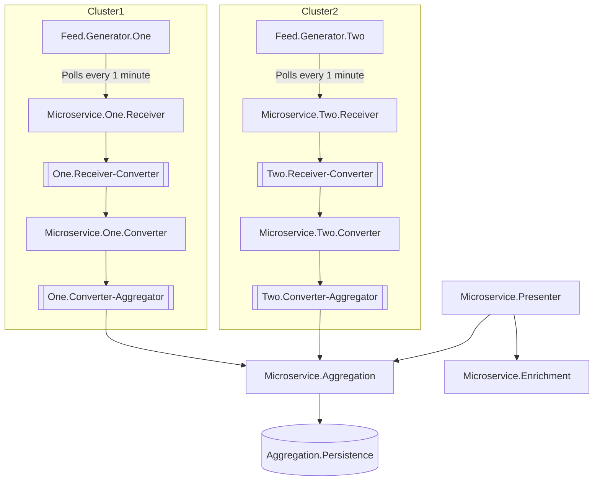
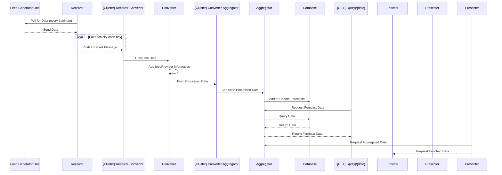
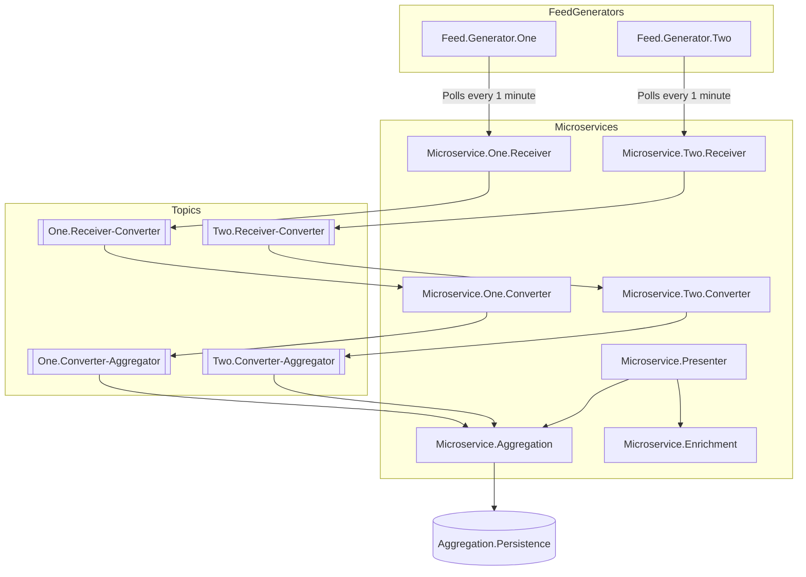

# Overview
This solution demonstrates the use of observability in microservices using a simple example. The project is structured to showcase how multiple microservices can be orchestrated using Aspire.NET, and how observability features provided by Aspire dashboards can be utilized to monitor and manage the system.

# Key Components
## Feed Generators
- `Feed.Generator.One`: Generates data for the first cluster of microservices.
- `Feed.Generator.Two`: Generates data for the second cluster of microservices.

## Microservices
- `Microservice.One.Receiver`: Receives data from Feed.Generator.One.
- `Microservice.One.Converter`: Converts the received data and adds additional information.
- `Microservice.Two.Receiver`: Receives data from Feed.Generator.Two.
- `Microservice.Two.Converter`: Converts the received data and adds additional information.
- `Microservice.Aggregation`: Aggregates data from multiple sources and stores it in the persistence layer.
- `Microservice.Enrichment`: Enriches the aggregated data with additional information.
- `Microservice.Presenter`: Presents the aggregated and enriched data to the end-users.

## Kafka Topics
- `One.Receiver-Converter`: Topic for data conversion from Microservice.One.Receiver.
- `Two.Receiver-Converter`: Topic for data conversion from Microservice.Two.Receiver.
- `One.Converter-Aggregator`: Topic for data aggregation from Microservice.One.Converter.
- `Two.Converter-Aggregator`: Topic for data aggregation from Microservice.Two.Converter.

## Persistence
- `Aggregation.Persistence`: Stores the aggregated data.

## Observability
The solution leverages Aspire.NET's observability features to monitor and manage the microservices. Aspire dashboards provide insights into the system's performance, health, and behavior. Key observability aspects include:
- Metrics: Collect and display metrics such as request counts, response times, and error rates.
- Logging: Centralized logging to capture and analyze logs from all microservices.
- Tracing: Distributed tracing to track the flow of requests across microservices.
- Health Checks: Regular health checks to ensure the services are running as expected.

# System Context Diagram
This diagram shows the system context of the solution, including the external systems that interact with the microservices. It provides a high-level overview of the system architecture and the relationships between the different components.

# Sequence Diagram

This diagram illustrates the sequence of events involving the microservices and Kafka topics. It shows how data flows through the system from the feed generators to the final presentation layer.

# Component Diagram
This diagram shows the main components of the solution, including feed generators, microservices, converters, and the aggregation persistence database. It illustrates the interactions between these components, providing a high-level overview of the system architecture.

# Learning outcomes
- How to structure a microservices solution using Aspire.NET.
    - Persistence of containers;
    - File system persistence of containers data;
    - Wait for dependencies in the containers;
    - Passing reference to the containers;
- Learn to use metrics, logging, tracing, and health checks for observability.
- Documenting the system architecture using mermaid diagrams.
- Use result pattern for better error handling and logging. ref: FluentResults.
- Using System.Text.Json for serialization and deserialization.
    - Custom converters for better serialization and deserialization.
- Addressing Cors policy in the API.
- Resilience handling in the http client.
- Minimal API and its associated working.
- Swagger, ReDoc, and Scalar for API documentation.
- Extending Aspire.NET dashboard using Commands.
- Extend editorconfig for better code formatting, styling and performance. ref: EditorConfig.
- Lazy pattern for singleton objects.
- Data conversions ref: UnitsNet.
- Messaging using Kafka. ref: Confluent.Kafka.
- ValueObject pattern for better domain modeling.
- Attribute based validation using System.ComponentModel.DataAnnotations.
- Option Pattern for configuration and validation.
- EFCore for persistence.
    - ValueConverters for better data storage.
    - Migrations for database schema management.
    - Using Docker for containerization.

# Upcoming Improvements
1. Presenter should use hybrid cache with redis for country data instead of calling enricher. 
    1. explore ResponseCaching;
    2. explore OutputCache;
2. Add exception handling and visitor pattern for it.
3. Add schemas for the API.
4. Extend swagger by:
    1. formats on the fields;
    2. add examples;
    3. add descriptions;
    4. add links to schemas;
5. Add schemas to dashboard using commands and provide button on swagger page as well, use the recent short from Nick about it. 
6. Log improvements.
7. Parallel processing in the conerter and aggregation service.
8. More functional programming and pattern matching in the services.
9. Add custom metrics to the services.
10. Add grafana dashboards for the services.
11. Default and Custom health checks for the services and dependencies.
12. Add tests:
    1. unit tests for the services. ref: AwesomeAssertions, tUnit, Moq, FakeDateTime, etc.
    2. integration tests for the dependenciesa and services.
    3. end to end tests for the services.
    4. functional tests for the services using test containers.
    5. performance tests for the services. ref: BenchmarkDotNet.
    6. load tests for the services. ref: NBomber or Locust.
    7. security tests for the services. ref: OWASP ZAP.
    8. mutation tests for the services. ref: Stryker.NET.
    9. contract tests for the services. ref: Pact.
    10. chaos tests for the services. ref: Chaos Monkey.
    11. architecture tests for the services. ref: ArchUnit.NET.
13. Add validations for options. 
14. Client side validation of received kafka messages.
15. Add interceptors for dbcontext.
16. Add interceptors for httpclient.
17. Add interceptors for kafka producer and consumer.
18. Add trace id or correlation id to the messages.
19. Add Upsert query for the database. Use the one created at work and improve it.
20. Using interporlated string library as an alternative to regex ref: InterpolatedParser.
21. Validations for naugthy strings. ref: NaughtyStrings.
22. CPM and Version locking for the dependencies.
23. UUIDv7 for the ids.
24. Use StringSyntax for better developer experience.
25. AOT for the services.

