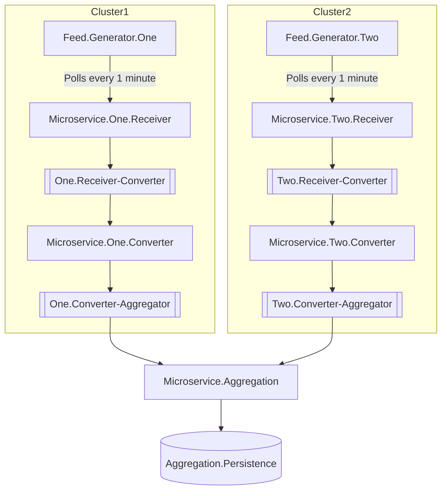
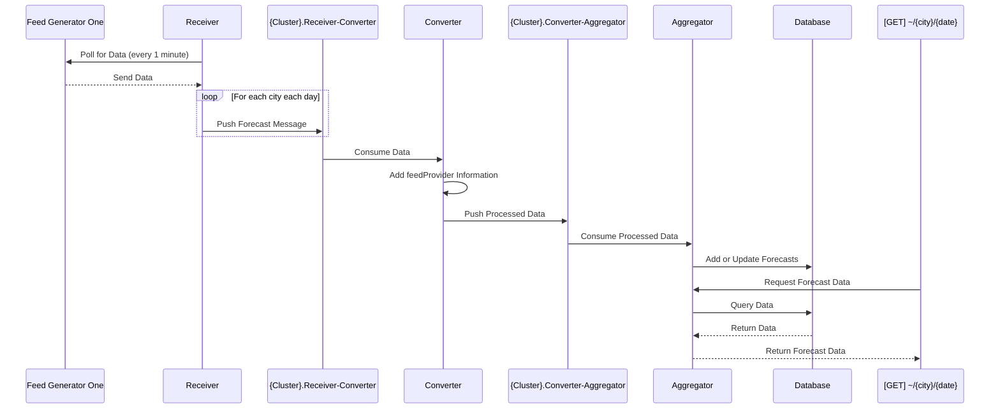

# Overview
Shows how to use observability in microservices using a simple example. Here is what the project structure looks like:

Here is a sequence of events involving the cluster:

Next tasks:
1. Presenter should use hybrid cache with redis for country data instead of calling enricher. use ResponseCaching
2. Add exception handling and visitor pattern for it
3. Specify DateOnly format on swagger UI as yyyy/mm/dd
4. Add schemas, use the recent short from Nick about it. 
5. Log improvements
6. Update diagrams and documentation
